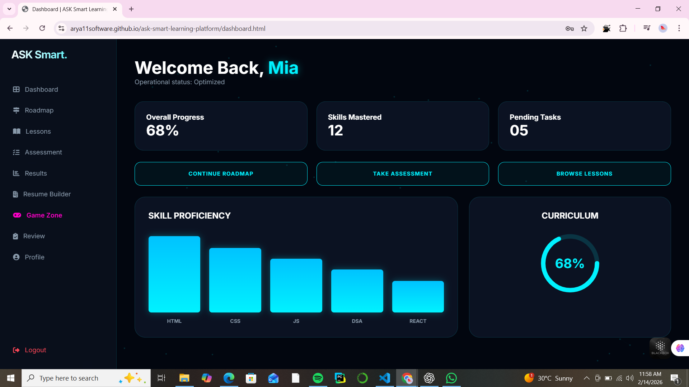

# ASK Smart Learning Platform

---

# ASK Smart Learning Platform

🔗 **Live Demo:** https://arya11software.github.io/ask-smart-learning-platform/

A system-designed, modular skill intelligence platform built using HTML, CSS, and JavaScript.  
Engineered to simulate a scalable learning ecosystem with assessment engine, dynamic roadmap generation, resume builder, analytics dashboard, and gamified learning modules.

---

## 🚀 Problem Statement

Students lack structured visibility into:
- Skill gaps
- Personalized learning paths
- Measurable progress tracking
- Resume alignment with technical growth

ASK Smart solves this by integrating:

• Skill assessment engine  
• Dynamic roadmap generator  
• Analytics dashboard  
• Resume builder  
• Gamified learning modules  
• Profile and performance tracking  

All delivered as a deployable production web application.

---

## 🏗 System Architecture (Client-Side Engine

User Interaction
↓
Assessment Engine
↓
Skill Evaluation Logic
↓
Roadmap Generator
↓
Dashboard Analytics
↓
Resume Builder + Profile Sync
---

### Core Design Principles

- Stateless UI rendering
- Client-side state management via localStorage
- Modular page separation (Single Responsibility Principle)
- Reusable layout structure
- Scalable component design
- Deployment-ready static hosting

---

## 📂 Project Structure

ask-smart-learning-platform/
│
├── index.html # Entry point (Authentication gateway)
├── register.html # User registration
├── dashboard.html # Analytics & progress overview
├── roadmap.html # Dynamic career roadmap engine
├── lessons.html # Learning modules
├── assessment.html # Skill testing modules
├── results.html # Performance analysis
├── review.html # Interactive skill evaluation
├── resume.html # Resume generator (PDF export)
├── profile.html # User data & analytics summary
├── gamezone.html # Gamified developer challenges
├── style.css # Central styling system
├── app.js # Core logic layer
└── assets/ # Media & images

---

---

## 🧠 Key Engineering Features

### 1️⃣ Skill Assessment Engine
- Multi-level scoring system
- Tier classification (Beginner / Intermediate / Advanced)
- Dynamic feedback generation

### 2️⃣ Roadmap Generator
- Domain-based learning path mapping
- Status-based milestone locking
- Progressive module unlocking logic

### 3️⃣ Dashboard Analytics
- Visual progress indicators
- Skill completion metrics
- Performance tracking architecture

### 4️⃣ Resume Builder
- Real-time preview engine
- HTML-to-PDF export using html2pdf
- Live synchronization between input and template

### 5️⃣ Persistent State Management
- localStorage-based session simulation
- User identity propagation across modules
- Lightweight client-side session handling

---

## ⚙️ Deployment Architecture

- Repository hosted on GitHub
- Continuous deployment via GitHub Pages
- Static hosting on:
https://arya11software.github.io/ask-smart-learning-platform/

Deployment Model:
Local Development → Git Commit → GitHub Repo → GitHub Pages → Live Production URL

---

## 📊 Performance & Optimization

- Lightweight static architecture
- No external backend dependencies
- Optimized asset loading
- Modular CSS styling
- Minimal JS runtime overhead

---

## 🎯 Engineering Decisions

| Decision | Reason |
|----------|--------|
| Static architecture | Faster deployment & simplicity |
| localStorage state | Avoid backend complexity for MVP |
| Modular HTML separation | Scalability & maintainability |
| GitHub Pages deployment | CI/CD experience exposure |

---

## 🔮 Future Scalability Roadmap

- Backend integration (Node.js / Express)
- Authentication system (JWT)
- Database integration (MongoDB / PostgreSQL)
- Real-time analytics engine
- API-driven modular architecture
- Conversion to React / Next.js SPA
- Cloud deployment (AWS / GCP / Azure)

---

## 💼 Resume Impact

This project demonstrates:

✔ System thinking  
✔ UI/UX architecture  
✔ Frontend engineering fundamentals  
✔ State management design  
✔ Deployment workflow knowledge  
✔ Product-level thinking  

---

## 👨‍💻 Author

**Arya Deshmukh**  
Computer Science Engineering Student  

Designed and built as a scalable skill intelligence platform prototype.

---

## 📜 License

MIT License

---

> Built with system design thinking.  
> Engineered for scale.  
> Deployed to production.

